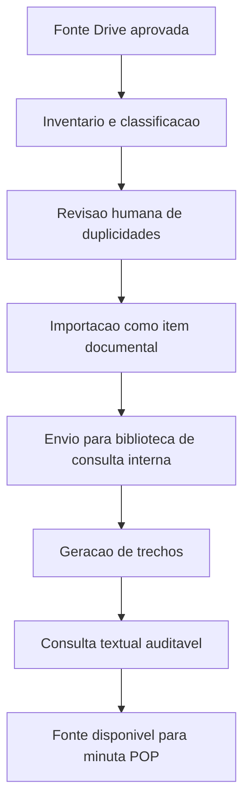
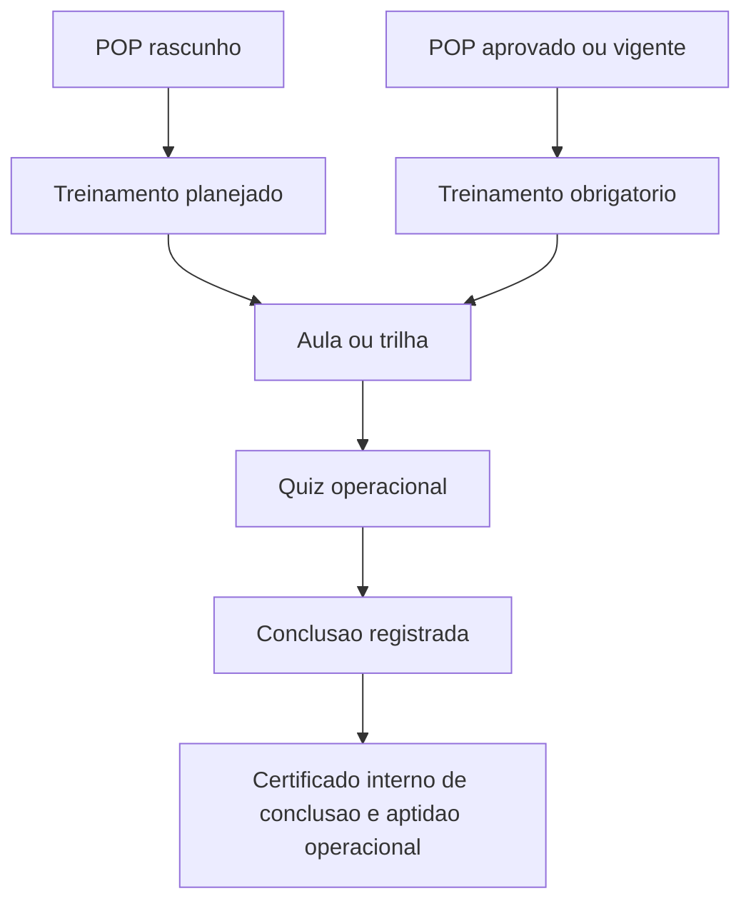
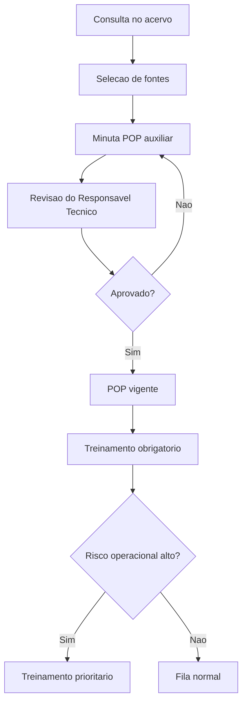
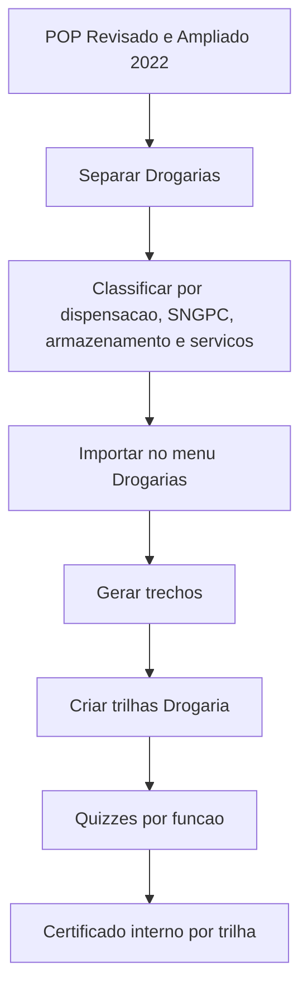
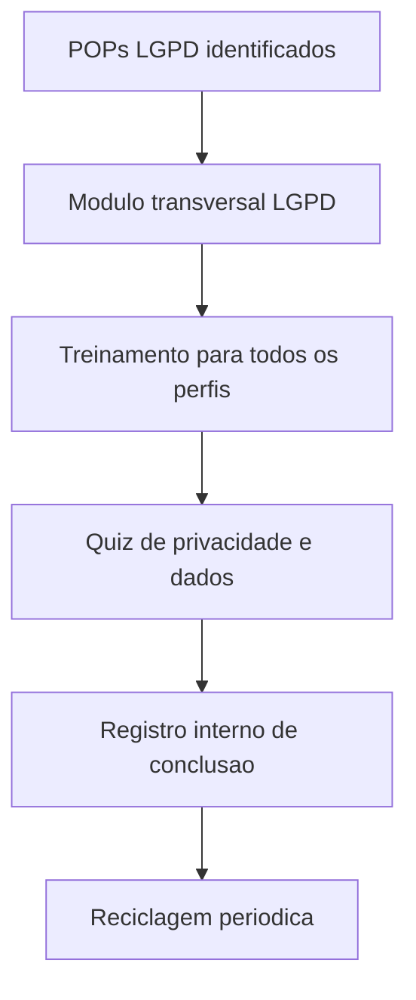

# Plano mestre de ingestao do acervo documental

## Status

Este documento replaneja a insercao do acervo no Visadocs considerando as fontes robustas novas e o inventario preliminar ja gerado. Nenhum arquivo foi importado no SaaS, nenhum dado foi gravado em banco, nenhum arquivo bruto foi movido e nenhuma rotina Prisma foi executada.

## Visao geral das fontes

### Fonte 1 - Material atualizado/editavel

- Link/fonte: `1qBY8vzGzilKV4H9sZInJEex4qJHeCiA8`
- Conteudo informado: 778 paginas, 162 POPs, 79 RQs e MBP.
- Estrutura observada no Drive: `POPs`, `RQs`, assuntos regulatorios relacionados a manipulacao veterinaria, arquivos nao disponibilizados, modelos nao finalizados, ZIP complementar e orientacao de leitura.
- Papel no SaaS: fonte matriz de farmacia de manipulacao, com maior prioridade para canonizacao, POPs, RQs e treinamento operacional.

### Fonte 2 - POP Revisado e Ampliado 2022

- Link/fonte: `1ERzSx0gaKOINDXPNYWhFgAIrbQjEYPya`
- Conteudo informado: 62 POPs, 242 paginas, 37 RQs e Manual de Boas Praticas de Dispensacao.
- Estrutura observada no Drive: POPs de drogaria, manual de boas praticas de dispensacao e ZIP complementar.
- Papel no SaaS: modulo Drogarias, com foco em operacao, dispensacao, armazenamento, higiene, servicos farmaceuticos e residuos.

### Fonte 3 - POPs LGPD

- Localizacao: identificar dentro das fontes ja inventariadas, especialmente entradas com `LGPD`.
- Papel no SaaS: modulo transversal aplicavel a farmacia de manipulacao, drogarias, colaboradores e gestao documental.
- Saida esperada: POPs de LGPD, treinamento transversal e quiz de entendimento operacional.

### Fonte 4 - Curso Boas Praticas e Controle de Qualidade

- Arquivos: `conteudo_modular.md` e `index.html`.
- Papel no SaaS: trilha de treinamento inicial, conteudo modular, quizzes e certificado interno de conclusao e aptidao operacional.

## Arquitetura das colecoes

Menus aprovados:

- Biblioteca POPs
- RQ's e MBP
- Drogarias
- Treinamentos

Colecoes logicas:

- Acervo Matriz Farmacia de Manipulacao
- POPs Farmacia de Manipulacao
- RQs Farmacia de Manipulacao
- Drogarias
- LGPD
- Curso Boas Praticas e Controle de Qualidade

## Estrutura final dentro do SaaS

### Biblioteca POPs

- 01. Gestao da Qualidade
- 02. Boas Praticas de Manipulacao
- 03. Higiene, Limpeza e Sanitizacao
- 04. Recebimento e Armazenamento
- 05. Materias-primas e Fornecedores
- 06. Manipulacao
- 07. Controle de Qualidade
- 08. Equipamentos, Calibracao e Manutencao
- 09. Rotulagem, Conferencia e Dispensacao
- 10. Nao Conformidades, Reclamacoes e Recolhimento
- 11. Residuos e Seguranca
- 12. Treinamentos Operacionais

### RQ's e MBP

- Manual de Boas Praticas
- Registros da Qualidade/Formularios
- Registros da Qualidade/Checklists
- Registros da Qualidade/Planilhas
- Registros da Qualidade/Evidencias
- Anexos

### Drogarias

- 01. Dispensacao
- 02. Medicamentos Controlados
- 03. SNGPC / Controle Especial
- 04. Recebimento e Armazenamento
- 05. Termolabeis
- 06. Servicos Farmaceuticos
- 07. Higiene e Limpeza
- 08. Farmacovigilancia
- 09. Residuos
- 10. Treinamentos Drogaria

### Treinamentos

- Boas Praticas e Controle de Qualidade
- Trilhas por funcao
- Quizzes
- Certificados internos
- Reciclagens

## Regras de negocio aprovadas

- POP em rascunho gera treinamento planejado.
- POP aprovado/vigente gera treinamento obrigatorio.
- Treinamento prioritario e permitido e pode furar fila.
- Certificado significa certificado interno de conclusao e aptidao operacional.
- Nenhum documento importado deve virar POP vigente automaticamente.
- Toda aprovacao de POP deve passar por revisao do Responsavel Tecnico.
- Toda minuta gerada a partir de fontes canonicas deve manter rastreabilidade de fonte.

## Estrategia de importacao em lotes

### Lote 1 - Acervo Matriz Farmacia de Manipulacao

- Objetivo: estabelecer a base canonica de referencia para farmacia de manipulacao.
- Fonte: Material atualizado/editavel, link `1qBY8vzGzilKV4H9sZInJEex4qJHeCiA8`.
- Criterio de entrada: arquivos legiveis, editaveis e classificados como matriz/MBP/referencia.
- Destino no SaaS: Biblioteca POPs, RQ's e MBP e acervo canonico.
- Uso canonico: SIM, como fonte primaria.
- Uso em treinamento: PLANEJADO para conteudos operacionais.
- Uso em quiz: REVISAR por tema.
- Uso em certificado: SIM quando vinculado a treinamento obrigatorio ou prioritario.
- Prioridade: P0.
- Risco: medio, por volume e possivel sobreposicao com fontes antigas.
- Criterio de aceite: matriz classificada, sem duplicidade critica, com chunks canonicos gerados e revisados em amostra.

### Lote 2 - POPs Farmacia de Manipulacao

- Objetivo: importar e organizar POPs operacionais de farmacia de manipulacao.
- Fonte: pasta `POPs` da Fonte 1 e demais pastas de POPs ja inventariadas.
- Criterio de entrada: POP com titulo, tema, origem e versao identificaveis.
- Destino no SaaS: Biblioteca POPs.
- Uso canonico: SIM.
- Uso em treinamento: POP rascunho = treinamento planejado; POP aprovado/vigente = treinamento obrigatorio.
- Uso em quiz: SIM para POPs operacionais criticos.
- Uso em certificado: SIM, como certificado interno de conclusao e aptidao operacional.
- Prioridade: P0.
- Risco: medio, por necessidade de revisao RT antes de vigencia.
- Criterio de aceite: POPs importados como rascunho/referencia, sem aprovacao automatica e com trilhas sugeridas.

### Lote 3 - RQs Farmacia de Manipulacao

- Objetivo: importar registros da qualidade e formularios vinculados aos POPs.
- Fonte: pasta `RQs` da Fonte 1 e itens RQ do inventario.
- Criterio de entrada: RQ com relacao clara a POP, processo ou evidencia operacional.
- Destino no SaaS: RQ's e MBP.
- Uso canonico: SIM, quando o RQ explica ou comprova processo.
- Uso em treinamento: APOIO, salvo RQs criticos que virem atividade obrigatoria.
- Uso em quiz: REVISAR.
- Uso em certificado: NAO por padrao; SIM apenas quando vinculado a treinamento pratico.
- Prioridade: P1.
- Risco: baixo/medio, por dependencia de vinculo correto com POPs.
- Criterio de aceite: RQs classificados por tipo, com codigos normalizados e relacao sugerida com POPs.

### Lote 4 - Drogarias

- Objetivo: incorporar o pacote POP Revisado e Ampliado 2022 no modulo Drogarias.
- Fonte: link `1ERzSx0gaKOINDXPNYWhFgAIrbQjEYPya`.
- Criterio de entrada: POPs e RQs de drogaria separados da farmacia de manipulacao.
- Destino no SaaS: Drogarias e Treinamentos Drogaria.
- Uso canonico: SIM, como colecao setorial propria.
- Uso em treinamento: OBRIGATORIO para POPs vigentes de drogaria; PLANEJADO para rascunhos.
- Uso em quiz: SIM para atendimento, dispensacao, controlados, SNGPC, termolabeis e servicos.
- Uso em certificado: SIM, certificado interno de conclusao e aptidao operacional por trilha.
- Prioridade: P0.
- Risco: medio, por possivel duplicidade com a primeira pasta de Drogarias ja inventariada.
- Criterio de aceite: Drogarias separadas de manipulacao, com trilhas proprias e duplicidades resolvidas.

### Lote 5 - LGPD

- Objetivo: criar modulo transversal de LGPD para colaboradores e gestores.
- Fonte: itens `POPs_LGPD para Farmacias de Manipulacao` e correlatos dentro das fontes.
- Criterio de entrada: material com foco em dados pessoais, privacidade, documentos, acesso, armazenamento ou atendimento.
- Destino no SaaS: Biblioteca POPs, Treinamentos e, quando aplicavel, RQ's e MBP.
- Uso canonico: SIM.
- Uso em treinamento: OBRIGATORIO para todos os perfis operacionais.
- Uso em quiz: SIM.
- Uso em certificado: SIM, certificado interno transversal.
- Prioridade: P0/P1, conforme escopo do piloto.
- Risco: medio, por necessidade de linguagem juridica prudente e aderente ao uso operacional.
- Criterio de aceite: modulo transversal criado, quiz minimo aprovado e sem promessa de conformidade legal garantida.

### Lote 6 - Curso Boas Praticas e Controle de Qualidade

- Objetivo: transformar `conteudo_modular.md` e `index.html` em trilha inicial de treinamento.
- Fonte: arquivos `conteudo_modular.md` e `index.html`.
- Criterio de entrada: conteudo dividido em modulos, aulas ou secoes avaliaveis.
- Destino no SaaS: Treinamentos.
- Uso canonico: SIM como apoio didatico.
- Uso em treinamento: OBRIGATORIO para onboarding ou PRIORITARIO para reciclagem.
- Uso em quiz: SIM.
- Uso em certificado: SIM, certificado interno de conclusao e aptidao operacional.
- Prioridade: P0.
- Risco: baixo/medio, por necessidade de adaptar conteudo ao formato de aulas/quizzes.
- Criterio de aceite: trilha criada, quiz minimo definido, criterios de conclusao registrados e certificado interno emitido apenas apos conclusao.

## Deduplicacao

Deduplicacao deve acontecer antes da importacao, em tres niveis:

1. Nome normalizado: detectar POPs e RQs com mesmo nome, mesmo codigo ou variacao menor.
2. Origem e versao: manter fonte robusta mais atual como primaria e fonte antiga como referencia historica.
3. Conteudo: quando possivel, comparar hash/texto extraido para evitar duplicar documento equivalente.

Politica sugerida:

- Fonte 1 prevalece como matriz para farmacia de manipulacao.
- Fonte 2 prevalece para Drogarias.
- Arquivos ZIP nao devem ser importados diretamente; devem ser extraidos/listados em ambiente temporario.
- Materiais duplicados nao devem ser apagados sem revisao humana; devem ser marcados como `DUPLICADO_CANDIDATO`.

## Canonizacao

Canonizacao proposta:

1. Importar documento como item de biblioteca ou referencia.
2. Enviar para biblioteca de consulta interna.
3. Gerar trechos/chunks determininos.
4. Revisar status e classificacao.
5. Permitir consulta textual auditavel.
6. Permitir minuta POP com fontes selecionadas.

Nenhuma etapa de canonizacao deve criar POP vigente automaticamente.

## Treinamento, quizzes e certificados internos

Regras:

- POP em rascunho cria treinamento planejado.
- POP aprovado/vigente cria treinamento obrigatorio.
- Treinamento prioritario pode furar fila.
- Certificado e sempre interno: conclusao e aptidao operacional, sem valor de certificacao externa.

Quizzes:

- Devem ser gerados ou revisados por tema.
- Devem priorizar POPs de risco operacional, atendimento, controle de qualidade, higiene, manipulacao, dispensacao, LGPD e SNGPC.
- Devem ter questoes rastreaveis ao POP/trecho de origem.

## Fluxograma 1 - pipeline de ingestao documental

## Fluxograma 2 - pipeline de treinamento e certificacao interna

## Fluxograma 3 - pipeline de POP sob demanda e treinamento prioritario

## Fluxograma 4 - pipeline Drogarias

## Fluxograma 5 - pipeline LGPD

## Criterios de aceite

- Todas as fontes robustas estao representadas no inventario ou no plano de lote.
- Cada lote tem destino claro no SaaS.
- Materiais de drogaria nao se misturam com farmacia de manipulacao.
- LGPD e tratado como modulo transversal.
- Curso de Boas Praticas e Controle de Qualidade vira trilha propria.
- POPs rascunho nao geram obrigatoriedade ate aprovacao.
- POPs aprovados/vigentes geram treinamento obrigatorio.
- Certificados sao descritos como internos.
- Duplicidades sao marcadas antes de importacao.
- Nenhum importador e executado sem aprovacao humana.

## Riscos

- Volume elevado da Fonte 1 pode gerar duplicidade ou classificacao imprecisa.
- ZIPs e pastas precisam de inventario profundo antes de importacao.
- POPs antigos e revisados podem representar versoes diferentes do mesmo processo.
- RQs podem ficar desconectados dos POPs se a relacao nao for revisada.
- LGPD exige linguagem prudente, sem promessa de conformidade legal garantida.
- Certificado interno deve evitar qualquer leitura de certificacao externa.

## Ordem de execucao recomendada

1. Validar a estrutura de pastas e menus com humano responsavel.
2. Executar inventario profundo da Fonte 1.
3. Deduplicar Fonte 1 contra inventario ja gerado.
4. Importar piloto pequeno da Fonte 1: 5 POPs, 5 RQs e MBP.
5. Validar canonizacao e consulta textual.
6. Importar lote Drogarias com deduplicacao contra pasta anterior.
7. Separar e validar modulo LGPD.
8. Transformar `conteudo_modular.md` e `index.html` em trilha.
9. Criar quizzes e criterios de conclusao.
10. Rodar QA autenticado com ADMIN, RT e OPERADOR.

## Perguntas pendentes para aprovacao humana

- A Fonte 1 deve substituir as fontes anteriores ou coexistir como nova versao matriz?
- Os 162 POPs da Fonte 1 devem entrar todos como rascunho inicialmente?
- Os 79 RQs da Fonte 1 devem ser importados todos ou apenas os vinculados aos POPs piloto?
- Qual criterio define POP vigente no primeiro ciclo: revisao RT individual ou aprovacao por lote?
- Drogarias sera liberado no mesmo piloto ou em segundo momento?
- LGPD sera treinamento obrigatorio para todos os perfis desde o inicio?
- O certificado interno deve ter validade/reciclagem padrao por modulo?
- Quem aprova a lista final de duplicidades antes da importacao?
